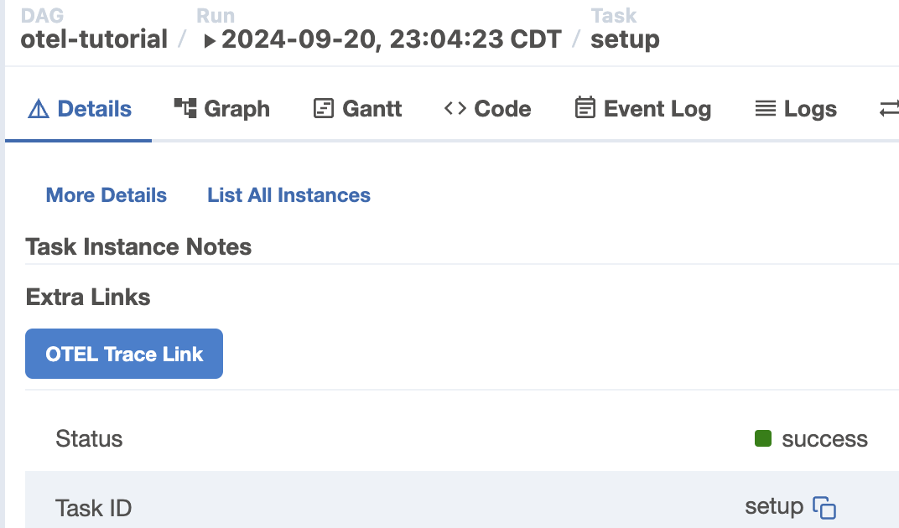

# airflow_otel_provider
Airflow Provider for OpenTelemetry is an Airflow provider composed of the following:
- OTEL hook : provides means for user to emit trace(spans), metrics, and logs within their DAG file
- OTEL listener : provides alternative means to generate trace on the DAG run
- OTEL logging provider : integrates task and application logging with OpenTelemetry for unified observability

## How the provider works with Airflow
[Airflow release 2.10.0](https://airflow.apache.org/docs/apache-airflow/2.10.0/release_notes.html#opentelemetry-traces-for-apache-airflow-37948) Now has OTEL traces implemented, which means that Airflow can natively emit traces on jobs and DAG runs in OTEL format. This provider works well with the version of Airflow that has this trace enabled.

- If the airflow is enabled with traces (and sending trace data), provider's listener will be `disabled`, while otel hook would use the connection configuration not from its connection info, but directly from the airflor's otel configuration. That means users don't have to create redundant connection to it.
- If the airflow is disabled with traces or does not support traces (due to of it being older version), then provider's listener will be `enabled`, and otel hook would use the connection configuration from the connections of type `otel`.
- If the airflow does not support any traces, and connection is not defined, then provider's listener and hooks will `NOT` function.

## How to install the provider
After checking out this repo in your local env, you can install the opentelemetry provider using pip.
```
pip install ./airflow_provider_opentelemetry
```

## How to use the OTEL Hook

### Configuring the connection

OTEL Connection would have the following parameters in its configuration UI:

- OTEL endpoint URL
- HTTP Header Name for API key
- API Key
- Export interval in ms(for metrics)
- disabled

#### OTEL endpoint URL
It's the URL for emitting OTEL data (in OTLP HTTP protocol). Example: http://my-otel-endpoint:4318

#### HTTP Header Name for API key (Optional)
Sometimes, the endpoint may require you to specify header name of the API Key. In that case, you may provide one.

#### API Key (Optional)
API key that is paired with the HTTP header name

#### Export internal in ms(for metrics)
As for sending metrics data, everything is sent in timed interval (e.g. every 30 seconds). This will specify that internal
in the unit of milliseconds.

#### Disabled (Optional)
This is currently NOT implemented (coming up in future), but when checked, this will effectively 'disable' the hook and listener.
You may need to restart Airflow in order for this to take action, but a great way to turn it off without deleting the connection.

### Using Otel hook inside the DAG file

#### Traces

You can use `span` decorator to indicate that a particular function would be emitting its span when running.

```python
from airflow_provider_opentelemetry.hooks.otel import OtelHook

    # get otel hook first. Use the parameterless constructor in 2.10+ to share the server's OTLP config.
    otel_hook = OtelHook("otel_conn")
...

    # use hotel_hook's span decorator
    @otel_hook.span
    def setup():
        span = trace.get_current_span()
        span.set_attribute('app.msg', 'sleeping for 1 second')
        time.sleep(1)

    # simple setup operator in python
    t0 = PythonOperator(
        task_id="setup",
        python_callable=setup
    )

```

You can also use a special parameter called `dag_context` to receive the DAG run's context as input of the function, to initiate a new span.

```python
from airflow_provider_opentelemetry.hooks.otel import OtelHook

...

    def setup(**dag_context):
        with otel_hook.start_as_current_span(name="do_setup", dag_context=dag_context) as s:
            s.set_attribute("data quality", "fair")
            s.set_attribute("description", "You can add attributes in otel hook to have business or data specific details on top of existing task instnace span.")
            with otel_hook.start_as_current_span(name="do_sleep") as ss:
                ss.set_attribute("sleep for", "one second")
                time.sleep(1)

    # simple setup operator in python
    t0 = PythonOperator(
        task_id="setup",
        python_callable=setup
    )
```

#### How to use TracerProvider of the OtelHook
The hook exposes a `TracerProvider` that can be used to send additional traces through the same OTLP connection. To add additional traces or to use instrumentation libraries, use the `trace_provider` property as below:

```python
from airflow_provider_opentelemetry.hooks.otel import OtelHook
import requests
from opentelemetry import trace
from opentelemetry.instrumentation.requests import RequestsInstrumentor

# get the Open Telemetry hook
otel_hook = OtelHook()

RequestsInstrumentor().instrument(tracer_provider=otel_hook.tracer_provider)

tracer = trace.get_tracer("trace_test.tracer", tracer_provider=otel_hook.tracer_provider)

@otel_hook.span
def call_github():
    # N.B. This is using `tracer` not `otel_hook` 
    with tracer.start_as_current_span(name="Make GitHub call")
        r = requests.get('https://api.github.com/events')

# simple setup operator in python
t0 = PythonOperator(
    task_id="call_github",
    python_callable=call_github
)
```

#### Logs

You can also submit your very own log message which then can automatically converted and linked to OTEL log record within the span context.

```python
    def setup(**dag_context):
        with otel_hook.start_as_current_span(name="do_setup", dag_context=dag_context) as s:
            s.set_attribute("data quality", "fair")
            s.set_attribute("description", "You can add attributes in otel hook to have business or data specific details on top of existing task instnace span.")
            with otel_hook.start_as_current_span(name="do_sleep") as ss:
                ss.set_attribute("sleep for", "one second")

                # emit 'info' log.
                otel_hook.otellog('info','this is an information log')

                time.sleep(1)

    # simple setup operator in python
    t0 = PythonOperator(
        task_id="setup",
        python_callable=setup
    )
```

#### Metrics

> ⚠️ Metrics, unlike traces, do not have contexts (e.g. dag run, trace, etc), and have intervals for them to be reported in a fixed amount of time. Because of this, please note that if what you instrument would likely be very short and end before the set interval time (e.g. 5 seconds), those metrics will not have time to be emitted. In that case, generating span or span events may be a better way to instrument those.

You can use otel hook to increment counter of certain actions
```python
    otel_hook.incr('my.counter')
...
    otel_hook.decr('my.counter')
```

You can use otel hook to set value of a gauge type metric
```python
    otel_hook.gauge('my.gauge', 12345)
```

You can use timing to record delta time
```python
    last_finish_time = timezone.utcnow()
    last_duration = last_finish_time - processor.start_time
    file_name = 'myfile.txt'
    otel_hook.timing("my.last_duration", last_duration, tags={"file_name": file_name})
```

#### External Links

##### Traces

This provide can provide external links in the trace instance view.
You may need to define the following env. variable to do so.

```
AIRFLOW_OTEL_TRACE_LINK='https://ui.honeycomb.io/demo/environments/otel-workshop/trace?trace_id={trace_id}&span={span_id}&trace_start_ts={start_date_ts}'
```

When the environment is defined, you will be able to see the following button named `OTEL Trace Link` shown under `Extra LInks` section.


The above example is when you are using [Honeycomb](https://honeycomb.io) as the OTEL backend to ingest the traces.

The following attributes are supported in the template string:
- trace_id : denotes the current trace_id of the dag run
- span_id : denotes the current span_id of the task instance
- start_date_ts : start date (minus 10 sec) in UNIX EPOCH seconds
- end_date_ts : end date (plus 10 sec) in UNIX EPOCH seconds

## OpenTelemetry Logging Provider

### Overview

The OpenTelemetry Logging Provider enables you to send Airflow task logs and application logs to your OpenTelemetry collector in OTLP format. This provides unified observability by correlating logs with traces and spans, allowing you to:

- View logs alongside traces in your observability platform
- Filter logs by trace_id and span_id for debugging
- Analyze log patterns across DAG runs and tasks
- Maintain existing file-based logging while adding OTEL integration

### How It Works

The logging provider extends Airflow's standard `FileTaskHandler` to:
1. Continue writing logs to local files (standard Airflow behavior)
2. Simultaneously emit logs to your OTEL collector via OTLP/HTTP
3. Automatically correlate logs with traces using trace_id and span_id
4. Include task context (dag_id, task_id, execution_date, try_number)

### Configuration

The logging provider can be configured in three ways (in order of precedence):

#### Option 1: Using Airflow's Native OTEL Configuration (Recommended for Airflow 2.10+)

If you're using Airflow 2.10+ with native OTEL traces support, add to your `airflow.cfg`:

```ini
[logging]
logging_config_class = airflow_provider_opentelemetry.log_handlers.otel_logging_config.OTEL_LOGGING_CONFIG

[traces]
otel_on = True
otel_host = localhost
otel_port = 4318
otel_ssl_active = False
otel_service = Airflow
```

#### Option 2: Using Environment Variables

Set these environment variables before starting Airflow:

```bash
export OTEL_EXPORTER_OTLP_ENDPOINT=http://localhost:4318
export OTEL_SERVICE_NAME=Airflow

# Optional: For authenticated endpoints
export OTEL_EXPORTER_OTLP_HEADERS_API_KEY_NAME=x-api-key
export OTEL_EXPORTER_OTLP_HEADERS_API_KEY=your-api-key-here
```

Then update `airflow.cfg`:

```ini
[logging]
logging_config_class = airflow_provider_opentelemetry.log_handlers.otel_logging_config.OTEL_LOGGING_CONFIG
```

#### Option 3: Using OTEL Connection (Fallback)

Create an Airflow connection with ID `otel_default` (type: `otel`) and configure:
- Host: `http://localhost:4318`
- Login: API key header name (optional)
- Password: API key value (optional)
- Port: Export interval in milliseconds (for metrics)

Then update `airflow.cfg`:

```ini
[logging]
logging_config_class = airflow_provider_opentelemetry.log_handlers.otel_logging_config.OTEL_LOGGING_CONFIG
```

### Setup Instructions

#### Step 1: Install the Provider

```bash
pip install ./airflow_provider_opentelemetry
```

#### Step 2: Update airflow.cfg

Add the logging configuration to your `airflow.cfg` file. A complete example configuration:

```ini
[logging]
# Enable OTEL logging provider
logging_config_class = airflow_provider_opentelemetry.log_handlers.otel_logging_config.OTEL_LOGGING_CONFIG

# Standard Airflow logging settings
base_log_folder = ${AIRFLOW_HOME}/logs
remote_logging = False
task_log_reader = task
logging_level = INFO
fab_logging_level = WARN
```

For a complete configuration example, see: `airflow_provider_opentelemetry/log_handlers/airflow_otel_logging_config_example.cfg`

#### Step 3: Configure OTEL Endpoint

Choose one of the three configuration options above based on your setup.

#### Step 4: Restart Airflow

Restart all Airflow components for the logging configuration to take effect:

```bash
# Restart webserver
airflow webserver --daemon

# Restart scheduler
airflow scheduler --daemon
```

#### Step 5: Verify Logging

1. Run a test DAG
2. Check your OTEL backend for log records
3. Verify logs are correlated with traces using trace_id and span_id

### Features

#### Automatic Trace Correlation

Logs are automatically correlated with traces and spans:

```python
# In your DAG task, logs will automatically include:
# - trace_id: Links log to the DAG run trace
# - span_id: Links log to the specific task span
# - dag_id, task_id, execution_date, try_number: Task context

def my_task(**context):
    # Standard Python logging works automatically
    logging.info("Starting data processing")  # Sent to OTEL with trace context
    
    # Process data
    logging.info("Processed 1000 records")  # Also sent to OTEL
```

#### Task Context in Logs

Every log record includes:
- `trace_id`: Trace ID for the DAG run
- `span_id`: Span ID for the task instance
- `dag_id`: DAG identifier
- `task_id`: Task identifier
- `execution_date`: Task execution date
- `try_number`: Task attempt number

#### File and OTEL Dual Logging

The provider maintains both logging outputs:
- Local files: Standard Airflow log files in `$AIRFLOW_HOME/logs`
- OTEL: Log records sent to your OTEL collector

This ensures backward compatibility and gradual migration.

### Integration with Other OTEL Features

The logging provider works seamlessly with other OTEL features:

```python
from airflow_provider_opentelemetry.hooks.otel import OtelHook
from airflow.decorators import task
import logging

@task
def process_data(**context):
    otel_hook = OtelHook()
    logger = logging.getLogger(__name__)
    
    # Create a custom span
    with otel_hook.start_as_current_span("data_processing", dag_context=context):
        # Logs within this span are automatically correlated
        logger.info("Starting data validation")
        
        # Your processing logic
        validate_data()
        
        logger.info("Data validation complete")
        
        # Custom OTEL log with explicit severity
        otel_hook.otellog('info', 'Custom OTEL log message')
```

### Troubleshooting

#### Logs Not Appearing in OTEL Backend

1. Verify OTEL endpoint configuration:
   ```python
   # Check Airflow logs for initialization messages
   # Should see: "OpenTelemetry task logging initialized successfully"
   ```

2. Check network connectivity to OTEL collector:
   ```bash
   curl -X POST http://your-otel-endpoint:4318/v1/logs
   ```

3. Verify Airflow configuration is loaded:
   ```bash
   airflow config get-value logging logging_config_class
   # Should return: airflow_provider_opentelemetry.log_handlers.otel_logging_config.OTEL_LOGGING_CONFIG
   ```

#### Logs Missing Trace Correlation

Ensure the logging provider is properly initialized before tasks run. Check:
1. `airflow.cfg` has correct `logging_config_class`
2. Airflow components were restarted after configuration changes
3. OTEL traces are enabled (either via native Airflow support or OTEL connection)

#### Performance Considerations

The logging provider uses batch processing to minimize performance impact:
- Logs are buffered and sent in batches
- Asynchronous export prevents blocking task execution
- Configurable batch size and export interval

For high-volume logging scenarios, consider:
- Adjusting log levels (use INFO or WARNING instead of DEBUG)
- Implementing log sampling in your OTEL collector
- Using local file logging as primary with OTEL as supplementary

### Advanced Configuration

#### Custom Logging Configuration

You can customize the logging configuration by creating your own config:

```python
# custom_logging_config.py
from airflow_provider_opentelemetry.log_handlers.otel_logging_config import OTEL_LOGGING_CONFIG

# Customize the configuration
CUSTOM_OTEL_LOGGING_CONFIG = OTEL_LOGGING_CONFIG.copy()
CUSTOM_OTEL_LOGGING_CONFIG['handlers']['task']['level'] = 'DEBUG'

def get_custom_otel_logging_config():
    return CUSTOM_OTEL_LOGGING_CONFIG
```

Then in `airflow.cfg`:

```ini
[logging]
logging_config_class = custom_logging_config.get_custom_otel_logging_config
```

#### Filtering Sensitive Data

The logging provider integrates with Airflow's secrets masker:

```python
# Sensitive data is automatically masked in logs
logging.info(f"Processing with API key: {api_key}")  # API key will be masked
```

### Examples

#### Basic Task Logging

```python
from airflow import DAG
from airflow.operators.python import PythonOperator
from datetime import datetime
import logging

def my_task():
    logger = logging.getLogger(__name__)
    
    logger.info("Task started")  # Automatically sent to OTEL
    
    # Your task logic
    result = perform_work()
    
    logger.info(f"Task completed with result: {result}")  # Also sent to OTEL

with DAG('example_otel_logging', start_date=datetime(2024, 1, 1)) as dag:
    task = PythonOperator(
        task_id='my_task',
        python_callable=my_task
    )
```

#### Logging with Custom Spans

```python
from airflow_provider_opentelemetry.hooks.otel import OtelHook
from airflow.decorators import dag, task
from datetime import datetime
import logging

@dag(start_date=datetime(2024, 1, 1), schedule=None)
def otel_logging_example():
    
    @task
    def process_with_logging(**context):
        otel_hook = OtelHook()
        logger = logging.getLogger(__name__)
        
        with otel_hook.start_as_current_span("main_process", dag_context=context):
            logger.info("Main process started")
            
            with otel_hook.start_as_current_span("sub_process_1"):
                logger.info("Sub process 1 executing")
                # Logs here are correlated with sub_process_1 span
                
            with otel_hook.start_as_current_span("sub_process_2"):
                logger.warning("Sub process 2 encountered warning")
                # Logs here are correlated with sub_process_2 span
            
            logger.info("Main process completed")
    
    process_with_logging()

dag = otel_logging_example()
```

### Backend-Specific Configuration

#### Honeycomb

```ini
[traces]
otel_on = True
otel_host = api.honeycomb.io
otel_port = 443
otel_ssl_active = True
otel_service = Airflow
```

Set environment variable for API key:
```bash
export OTEL_EXPORTER_OTLP_HEADERS_API_KEY_NAME=x-honeycomb-team
export OTEL_EXPORTER_OTLP_HEADERS_API_KEY=your-honeycomb-api-key
```

#### Jaeger (OTLP)

```ini
[traces]
otel_on = True
otel_host = localhost
otel_port = 4318
otel_ssl_active = False
otel_service = Airflow
```

#### Grafana Cloud

```ini
[traces]
otel_on = True
otel_host = otlp-gateway-prod-us-central-0.grafana.net
otel_port = 443
otel_ssl_active = True
otel_service = Airflow
```

Set environment variables:
```bash
export OTEL_EXPORTER_OTLP_HEADERS_API_KEY_NAME=Authorization
export OTEL_EXPORTER_OTLP_HEADERS_API_KEY="Basic <base64-encoded-credentials>"
```

